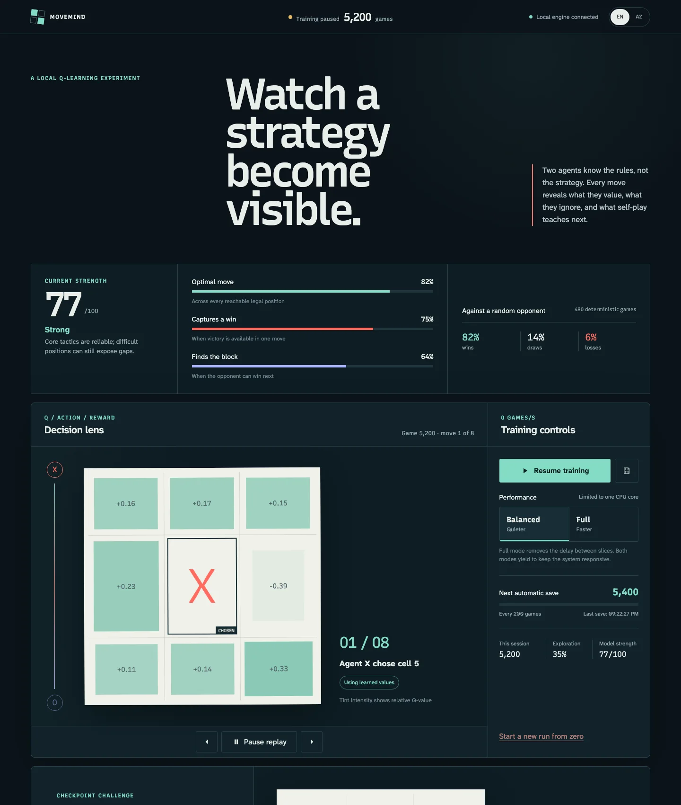
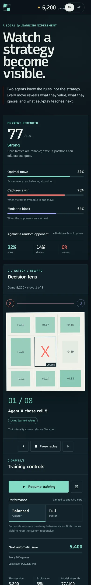

# MoveMind

[](../../actions/workflows/ci.yml)


A full-stack portfolio project that turns self-play Q-learning into an inspectable, interactive
experience. MoveMind currently includes Tic-Tac-Toe, while its typed game-plugin architecture is
designed to support additional finite, turn-based board games.



I built MoveMind to demonstrate how product design, frontend engineering, backend reliability, and
machine-learning fundamentals can work together in one focused system. It exposes the Q-values
behind legal moves, replays recent decisions, evaluates saved policies against a stable benchmark,
and lets you challenge the latest checkpoint—all without sending training data off-device.

[Azərbaycan dilində oxu](#azərbaycan-dilində)

## Engineering highlights

**Core stack:** React 19, TypeScript, Express 5, Zod, Vite, Vitest, and Playwright.

- **Extensible domain design:** game rules, evaluation, training, and presentation communicate
  through typed contracts instead of Tic-Tac-Toe-specific branches.
- **Reliable local persistence:** checkpoint writes are atomic, mutations are serialized, schemas
  are runtime-validated, and legacy data is migrated safely.
- **Deliberate frontend system:** feature-oriented React modules, custom CSS design tokens,
  self-hosted variable fonts, responsive layouts, and no utility-framework dependency.
- **Accessible interaction:** keyboard-operable controls, visible focus states, semantic status
  updates, 44 px targets, reduced-motion support, and layouts tested from 320 px upward.
- **Internationalized UI:** a typed English/Azerbaijani dictionary, persisted language preference,
  synchronized document locale, and locale-aware number and time formatting.
- **Evidence-based quality:** deterministic learning tests, API and failure-path integration tests,
  desktop/mobile E2E coverage, strict linting, type checks, production builds, and least-privilege CI.

## What you can inspect

- Live self-play with visible exploration and exploitation decisions
- Per-cell Q-values and an accessible, controllable replay
- Game-specific deterministic evaluation against fixed positions and seeded opponents
- Automatic and manual local checkpoints, isolated by game
- A playable challenge against a frozen copy of the latest policy
- Balanced and full-speed modes, both limited to one CPU core
- English and Azerbaijani interface text

## How learning works

Each player owns an independent Q-table. On its turn, an agent either explores a legal action or
selects the highest-valued action learned for that state. When a game ends, its reward is propagated
backwards through that player's decisions.

Evaluation belongs to the active game plugin because meaningful benchmarks differ between games.
The Tic-Tac-Toe plugin measures every checkpoint against the same reachable positions and
deterministic random-opponent matches:

- optimal move accuracy: 40%
- mandatory block accuracy: 25%
- immediate win capture: 20%
- seeded random-opponent result: 15%

MoveMind is an educational tabular Q-learning experiment, not a general game-playing system.

## Quick start

Requirements:

- Node.js 24 LTS
- npm 11 or later

```bash
git clone <your-repository-url>
cd movemind
nvm use
npm ci
cp .env.example .env
npm run dev
```

Open [http://127.0.0.1:5173](http://127.0.0.1:5173). Vite proxies API requests to the local engine
on port `4173`.

For a production build:

```bash
npm run build
npm start
```

The production server hosts the interface and engine at
[http://127.0.0.1:4173](http://127.0.0.1:4173).

## Configuration

| Variable                   | Default            | Purpose                                      |
| -------------------------- | ------------------ | -------------------------------------------- |
| `PORT`                     | `4173`             | Local production/API port                    |
| `GAME_ID`                  | `tic-tac-toe`      | Registered game plugin to run                |
| `CHECKPOINT_INTERVAL`      | `200`              | Games between automatic checkpoints          |
| `MAX_CHECKPOINTS`          | `50`               | Maximum archived checkpoints per game        |
| `TRAINING_AUTO_START`      | `false`            | Start training when the engine starts        |
| `DEFAULT_PERFORMANCE_MODE` | `balanced`         | Initial mode: `balanced` or `full`           |
| `CHECKPOINT_DIR`           | `data/checkpoints` | Root directory for game-specific checkpoints |

Invalid configuration, including an unknown `GAME_ID`, stops startup with a clear error.

## Architecture

```text
shared/                    Shared domain and API contracts
server/
  games/
    contracts.ts           Stable rules and plugin interfaces
    registry.ts            Explicit game registration
    tic-tac-toe/           Rules, evaluator, and plugin composition
  agent.ts                 Game-agnostic tabular Q-learning agent
  trainer.ts               Serialized training and checkpoint lifecycle
  challenge.ts             Time-limited challenge sessions
  app.ts                   Validated HTTP API
src/
  components/              Shared interface elements
  features/                Decision, training, challenge, and insights
  hooks/                   Client orchestration and polling
  lib/                     Typed API and locale-aware formatting
  styles/                  Tokens, foundations, and feature styles
tests/                     Unit, schema, API, and localization tests
e2e/                       Desktop and mobile Playwright scenarios
```

The React client never owns training state. It polls the local Express engine, sends explicit
commands, and renders a public state containing the active game's descriptor. The trainer and
Q-agent depend on game contracts rather than Tic-Tac-Toe rules. Checkpoint mutations are serialized;
writes are atomic and every loaded file is runtime-validated.

The API exposes registered descriptors at `GET /api/games`. Selecting the active game is currently
a startup concern through `GAME_ID`; a runtime game picker is intentionally outside this release.

## Adding a game

The current contract targets finite, alternating, two-player, zero-sum board games with discrete
cell actions. To add one:

1. Create `server/games/<game-id>/rules.ts` implementing `GameRules`: descriptor, empty board, legal
   moves, winner resolution, state serialization, and deterministic action priority.
2. Add a game-specific evaluator and compose both parts as a `GamePlugin`.
3. Register the plugin in `server/games/registry.ts`.
4. Add deterministic rule, agent, evaluator, checkpoint, API, and responsive UI tests.
5. Set `GAME_ID=<game-id>` and run the complete validation suite.

The shared board, replay, Q-value, outcome, and challenge views adapt to the descriptor's dimensions,
marks, and player names. A game with a fundamentally different interaction model should receive a
dedicated client presentation instead of accumulating game-specific conditionals in shared
components.

## Scripts

| Command                 | Result                                           |
| ----------------------- | ------------------------------------------------ |
| `npm run dev`           | Run the interface and local engine in watch mode |
| `npm run build`         | Type-check and create the production client      |
| `npm start`             | Run the production server                        |
| `npm run lint`          | Run type-aware ESLint checks                     |
| `npm run format:check`  | Verify formatting                                |
| `npm test`              | Run unit and integration tests                   |
| `npm run test:coverage` | Generate a Vitest coverage report                |
| `npm run test:e2e`      | Run desktop and mobile Playwright scenarios      |
| `npm run check`         | Run formatting, lint, types, tests, and build    |

## Local data and privacy

Each game's JSON checkpoints live under `data/checkpoints/<game-id>/`. Version-one Tic-Tac-Toe
checkpoints in the former root location are migrated when loaded; incompatible or corrupted files
are skipped and logged without crashing the app. Generated policies, test output, `.env`, and build
artifacts are excluded from Git.

No analytics, remote model API, account, cookie, or external font request is used. Reset permanently
deletes only the active game's checkpoints from the configured local directory.

## Testing

Unit and integration tests cover rules, game registration, deterministic agent behavior, evaluation,
schema migration, API errors, checkpoint recovery, trainer serialization, session expiry, and EN/AZ
localization. Playwright verifies the training, replay, checkpoint, challenge, locale, responsive,
keyboard, and reduced-motion flows in Chromium.

Before opening a pull request, run:

```bash
npm run check
npm run test:e2e
npm audit --omit=dev
```

## Limitations

- Training uses one Node.js process and one CPU core.
- Tabular Q-learning does not scale well to large state or action spaces.
- New games require their own meaningful deterministic evaluator.
- Checkpoints are local files; there is no cloud synchronization.
- The app is intentionally local-only and has no hosted demo.

## Contributing and security

Read [CONTRIBUTING.md](CONTRIBUTING.md) before opening a pull request. Report vulnerabilities through
the private process in [SECURITY.md](SECURITY.md), not a public issue.

Released under the [MIT License](LICENSE).

---

# Azərbaycan dilində

MoveMind self-play Q-learning prosesini anlaşılan və interaktiv edən full-stack portfolio
layihəsidir. Hazırda Tic-Tac-Toe daxildir; typed oyun plagin arxitekturası isə gələcəkdə yeni, sonlu
və növbəli lövhə oyunlarının əlavə edilməsinə hazırdır.



MoveMind-i product design, frontend engineering, backend etibarlılığı və machine-learning
əsaslarının bir fokuslanmış sistemdə necə birləşdirilə biləcəyini göstərmək üçün hazırladım. Layihə
qanuni gedişlərin Q-dəyərlərini göstərir, son qərarları təkrar oynadır, saxlanmış strategiyaları sabit
benchmark ilə ölçür və son checkpoint-ə qarşı oynamağa imkan verir—təlim məlumatları cihazdan
kənara çıxmır.

[Read in English](#movemind)

## Mühəndislik istiqamətləri

**Əsas stack:** React 19, TypeScript, Express 5, Zod, Vite, Vitest və Playwright.

- **Genişlənə bilən domain dizaynı:** oyun qaydaları, qiymətləndirmə, təlim və təqdimat
  Tic-Tac-Toe-a bağlı şərtlər deyil, typed müqavilələr vasitəsilə əlaqələnir.
- **Etibarlı lokal yaddaş:** checkpoint yazıları atomikdir, mutasiyalar seriallaşdırılır, schema-lar
  runtime-da yoxlanır və köhnə məlumat təhlükəsiz miqrasiya olunur.
- **Məqsədli frontend sistemi:** feature-oriented React modulları, xüsusi CSS design tokenləri,
  self-hosted variable fontlar, responsive layout və utility framework-dən asılılığın olmaması.
- **Əlçatan interaction:** klaviatura ilə idarəetmə, görünən focus, semantik status yenilənmələri,
  44 px hədəflər, reduced-motion dəstəyi və 320 px-dən başlayan test olunmuş layout.
- **Lokalizasiya:** typed EN/AZ dictionary, yadda saxlanılan dil seçimi, sinxron document locale və
  locale-aware rəqəm və vaxt formatlaması.
- **Ölçülən keyfiyyət:** deterministik learning testləri, API və failure-path integration testləri,
  desktop/mobile E2E, sərt lint və type yoxlamaları, production build və least-privilege CI.

## Nələri izləmək mümkündür

- Kəşf və tətbiq qərarları görünən canlı self-play
- Hər xana üçün Q-dəyərləri və əlçatan, idarə olunan gediş təkrarı
- Sabit mövqelər və seed edilmiş rəqiblərlə oyuna uyğun deterministik qiymətləndirmə
- Hər oyun üçün ayrı saxlanan avtomatik və manual lokal checkpoint-lər
- Son strategiyanın dondurulmuş nüsxəsinə qarşı interaktiv oyun
- Bir CPU nüvəsi ilə məhdud balanslı və tam sürətli rejimlər
- İngilis və azərbaycan dillərində interfeys

## Öyrənmə necə işləyir

Hər oyunçu müstəqil Q-table saxlayır. Agent öz növbəsində ya qanuni gedişlərdən birini kəşf edir, ya
da həmin vəziyyət üçün öyrəndiyi ən yüksək dəyərli gedişi seçir. Oyun bitdikdə reward həmin oyunçunun
qərarları üzrə geriyə ötürülür.

Mənalı benchmark hər oyunda fərqli olduğu üçün qiymətləndirmə aktiv oyun plagininə aiddir.
Tic-Tac-Toe plagini hər checkpoint-i eyni çatıla bilən mövqelər və deterministik random rəqib
oyunları ilə ölçür:

- optimal gediş dəqiqliyi: 40%
- məcburi blok dəqiqliyi: 25%
- hazır qələbəni görmə: 20%
- seed edilmiş random rəqib nəticəsi: 15%

MoveMind ümumi oyun süni intellekti deyil, tabular Q-learning-i izah edən tədris eksperimentidir.

## Sürətli başlanğıc

Tələblər:

- Node.js 24 LTS
- npm 11 və ya daha yeni

```bash
git clone <repository-url>
cd movemind
nvm use
npm ci
cp .env.example .env
npm run dev
```

[http://127.0.0.1:5173](http://127.0.0.1:5173) ünvanını aç. Vite API sorğularını `4173` portundakı
lokal mühərrikə ötürür.

Production build üçün:

```bash
npm run build
npm start
```

Bu halda interfeys və mühərrik
[http://127.0.0.1:4173](http://127.0.0.1:4173) ünvanında birlikdə işləyir.

## Konfiqurasiya

| Dəyişən                    | Default            | Təyinat                                     |
| -------------------------- | ------------------ | ------------------------------------------- |
| `PORT`                     | `4173`             | Lokal production/API portu                  |
| `GAME_ID`                  | `tic-tac-toe`      | İşlədiləcək qeydiyyatlı oyun plagini        |
| `CHECKPOINT_INTERVAL`      | `200`              | Avtomatik checkpoint-lər arasındakı oyunlar |
| `MAX_CHECKPOINTS`          | `50`               | Hər oyun üçün maksimum arxiv sayı           |
| `TRAINING_AUTO_START`      | `false`            | Mühərrik açıldıqda təlimi başlatmaq         |
| `DEFAULT_PERFORMANCE_MODE` | `balanced`         | Başlanğıc rejimi: `balanced` və ya `full`   |
| `CHECKPOINT_DIR`           | `data/checkpoints` | Oyun checkpoint-ləri üçün əsas qovluq       |

Naməlum `GAME_ID` daxil olmaqla yanlış konfiqurasiya proqramı aydın xəta ilə dayandırır.

## Arxitektura

```text
shared/                    Ortaq domain və API müqavilələri
server/
  games/
    contracts.ts           Sabit qayda və plagin interfeysləri
    registry.ts            Oyunların açıq qeydiyyatı
    tic-tac-toe/           Qaydalar, evaluator və plagin kompozisiyası
  agent.ts                 Oyundan asılı olmayan tabular Q-learning agenti
  trainer.ts               Serial təlim və checkpoint lifecycle-ı
  challenge.ts             Müddətli challenge sessiyaları
  app.ts                   Validasiya olunan HTTP API
src/
  components/              Ortaq interfeys elementləri
  features/                Qərar, təlim, challenge və nəticələr
  hooks/                   Client orchestration və polling
  lib/                     Typed API və locale-aware formatlama
  styles/                  Tokenlər, baza və feature stilləri
tests/                     Unit, schema, API və lokalizasiya testləri
e2e/                       Desktop və mobil Playwright ssenariləri
```

React client təlim state-inə sahib deyil. Lokal Express mühərrikini periodik sorğulayır, açıq əmrlər
göndərir və aktiv oyunun descriptor-u daxil olan public state-i göstərir. Trainer və Q-agent
Tic-Tac-Toe qaydalarından deyil, oyun müqavilələrindən asılıdır. Checkpoint əməliyyatları
seriallaşdırılır, yazılar atomik aparılır və hər yüklənən fayl runtime-da yoxlanır.

Qeydiyyatlı oyun descriptor-ları `GET /api/games` endpoint-i ilə verilir. Aktiv oyun hazırda
`GAME_ID` vasitəsilə startup zamanı seçilir; runtime oyun seçicisi bu versiyanın scope-una daxil
deyil.

## Yeni oyun əlavə etmək

Hazırkı müqavilə diskret xana gedişləri olan sonlu, növbəli, iki oyunçulu, zero-sum lövhə oyunları
üçündür. Yeni oyun əlavə etmək üçün:

1. `GameRules` interfeysini tətbiq edən `server/games/<game-id>/rules.ts` yarat: descriptor, boş
   lövhə, qanuni gedişlər, qalibin hesablanması, state serialization və deterministik gediş
   prioriteti.
2. Oyuna uyğun evaluator əlavə et və hər iki hissəni `GamePlugin` kimi birləşdir.
3. Plagini `server/games/registry.ts` daxilində qeydiyyata al.
4. Qaydalar, agent, evaluator, checkpoint, API və responsive UI üçün deterministik testlər əlavə et.
5. `GAME_ID=<game-id>` təyin et və bütün yoxlama paketini işə sal.

Ortaq lövhə, replay, Q-value, nəticə və challenge görünüşləri descriptor-dakı ölçülərə, işarələrə və
oyunçu adlarına uyğunlaşır. Tamamilə fərqli interaction modeli olan oyun üçün ortaq komponentlərdə
çoxsaylı şərtlər toplamaq əvəzinə ayrıca client təqdimatı yaradılmalıdır.

## Scriptlər

| Əmr                     | Nəticə                                               |
| ----------------------- | ---------------------------------------------------- |
| `npm run dev`           | İnterfeys və mühərriki watch rejimində işə salır     |
| `npm run build`         | Type-check və production client build edir           |
| `npm start`             | Production serveri işə salır                         |
| `npm run lint`          | Type-aware ESLint yoxlamalarını işlədir              |
| `npm run format:check`  | Formatı yoxlayır                                     |
| `npm test`              | Unit və integration testlərini işlədir               |
| `npm run test:coverage` | Vitest coverage hesabatı yaradır                     |
| `npm run test:e2e`      | Desktop və mobil Playwright ssenarilərini işlədir    |
| `npm run check`         | Format, lint, type, test və build yoxlamalarını edir |

## Lokal məlumat və məxfilik

Hər oyunun JSON checkpoint-ləri `data/checkpoints/<game-id>/` altında saxlanılır. Əvvəlki əsas
qovluqda olan birinci versiya Tic-Tac-Toe checkpoint-ləri yüklənərkən miqrasiya edilir; uyğun olmayan
və ya pozulmuş fayllar tətbiqi çökdürmədən ötürülür və loglanır. Generasiya olunmuş strategiyalar,
test nəticələri, `.env` və build artefaktları Git-ə daxil edilmir.

Analytics, uzaq model API-si, hesab, cookie və xarici font sorğusu yoxdur. Reset yalnız aktiv oyunun
konfiqurasiya edilmiş lokal qovluğundakı checkpoint-lərini birdəfəlik silir.

## Testlər

Unit və integration testləri qaydaları, oyun qeydiyyatını, deterministik agent davranışını,
qiymətləndirməni, schema miqrasiyasını, API xətalarını, checkpoint bərpasını, trainer
serializasiyasını, sessiya müddətini və EN/AZ lokalizasiyanı yoxlayır. Playwright Chromium-da təlim,
replay, checkpoint, challenge, dil, responsive görünüş, klaviatura və reduced-motion axınlarını
yoxlayır.

Pull request açmazdan əvvəl:

```bash
npm run check
npm run test:e2e
npm audit --omit=dev
```

## Məhdudiyyətlər

- Təlim bir Node.js prosesi və bir CPU nüvəsi istifadə edir.
- Tabular Q-learning böyük state və action space-lərə yaxşı miqyaslanmır.
- Hər yeni oyun özünə uyğun mənalı deterministik evaluator tələb edir.
- Checkpoint-lər lokal fayllardır; cloud sinxronizasiya yoxdur.
- Tətbiq qəsdən lokal-only saxlanılıb və hosted demo daxil deyil.

## Töhfə və təhlükəsizlik

Pull request açmazdan əvvəl [CONTRIBUTING.md](CONTRIBUTING.md) faylını oxu. Təhlükəsizlik boşluqlarını
public issue ilə deyil, [SECURITY.md](SECURITY.md) sənədindəki private proseslə bildir.

Layihə [MIT License](LICENSE) ilə yayımlanır.
